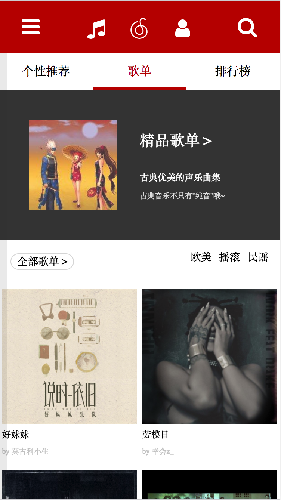
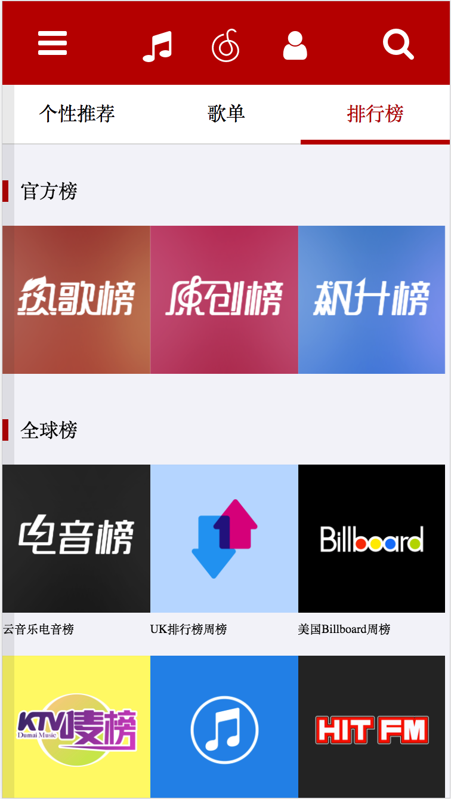
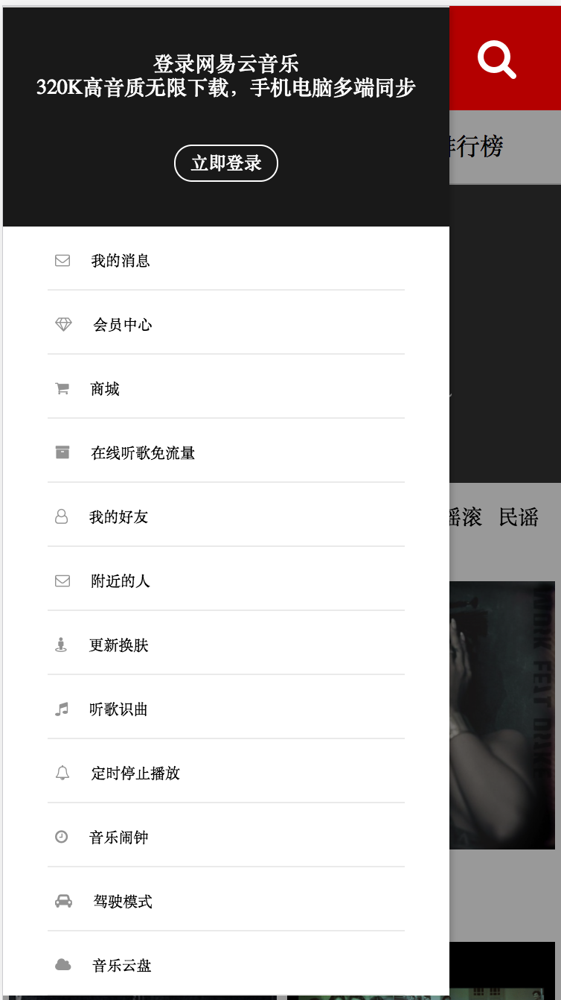

# net-ease-music
* Composed a mobile web app with React, MongoDB/Mongoose, Node.js for online music playing
* Developed the AJAX based frontend with Axio, Webpack, React, Redux and Antd-mobile for middlewares and reducers
* Implemented MVC backend with express.js on MongoDB
* Accomplished music playing functions with HTML5

